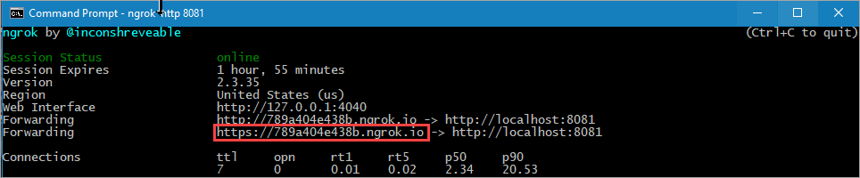

# Verifiable Credentials Code Sample

This code sample demonstrates how to use Microsoft Entra Verified ID to issue and consume verifiable credentials.

## Deploy to Azure

Complete the [setup](#Setup) before deploying to Azure so that you have all the required parameters.

[](https://portal.azure.com/#create/Microsoft.Template/uri/https%3A%2F%2Fraw.githubusercontent.com%2FAzure-Samples%2Factive-directory-verifiable-credentials-java%2Fmain%2F1-java-api-idtokenhint%2FARMTemplate%2Ftemplate.json)

You will be asked to enter some parameters during deployment about your app registration and your Verified ID details. You will find these values in the admin portal.


You need to enter the following parameters:

1. The app name. This needs to be globally unique as it will be part of your URL, like https://your-app-name.azurewebsites.net/
1. Your DID for your Entra Verified ID authority. After setting up Verified ID, you find your DID [here](https://entra.microsoft.com/?#view/Microsoft_AAD_DecentralizedIdentity/IssuerSettingsBlade)
1. The Credential Manifest URL for the [VerifiedCredentialExpert](https://entra.microsoft.com/#view/Microsoft_AAD_DecentralizedIdentity/CardsListBlade) credential type.

The deployment will take a few minutes as the Java app is being built the first time. You can monitor the progress with `Log stream`.

### Configuring Managed Identity

1. Enable Managed Identity for your App Service app at `Settings` > `Identity`
1. In portal.azure.com, open the `Cloud Shell` in powershell mode and run the following to grant your MSI service principal the permission to call Verified ID.

```Powershell
$TenantID="<YOUR TENANTID>"
$YourAppName="<NAME OF YOUR AZURE WEBAPP>"

#Do not change this values below
#
$ApiAppId = "3db474b9-6a0c-4840-96ac-1fceb342124f"
$PermissionName = "VerifiableCredential.Create.All"
 
# Install the module
Install-Module AzureAD

Connect-AzureAD -TenantId $TenantID

$MSI = (Get-AzureADServicePrincipal -Filter "displayName eq '$YourAppName'")

Start-Sleep -Seconds 10

$ApiServicePrincipal = Get-AzureADServicePrincipal -Filter "appId eq '$ApiAppId'"
$AppRole = $ApiServicePrincipal.AppRoles | Where-Object {$_.Value -eq $PermissionName -and $_.AllowedMemberTypes -contains "Application"}
New-AzureAdServiceAppRoleAssignment -ObjectId $MSI.ObjectId -PrincipalId $MSI.ObjectId ` -ResourceId $ApiServicePrincipal.ObjectId -Id $AppRole.Id
```

Restart the app after running the powershell script.

## Setup

### Entra ID tenant

You need an Entra ID tenant to get this sample to work. You can set up a [free tenant](https://learn.microsoft.com/en-us/entra/identity-platform/quickstart-create-new-tenant) unless you don't have one already.

### Setup Verified ID

[Setup Verified ID](https://learn.microsoft.com/en-us/entra/verified-id/verifiable-credentials-configure-tenant-quick) in your tenant and enable MyAccount. 
You do not need to register an app or create a custom Verified ID credential schema.

### Azure subscription

The sample is intended to be deployed to [Azure App Services](https://learn.microsoft.com/en-us/azure/app-service/) 
and use [Managed Identity](https://learn.microsoft.com/en-us/azure/app-service/overview-managed-identity) for authenticating and acquiring an access token to call Verified ID.
You don't need to do an app registration in Entra ID.

## Contents

The project is divided in 2 parts, one for issuance and one for verifying a verifiable credential. Depending on the scenario you need you can remove 1 part. To verify if your environment is completely working you can use both parts to issue a verifiedcredentialexpert VC and verify that as well.

| Issuance | |
|------|--------|
| src\main\resources\static\issuer.html|The basic webpage containing the javascript to call the APIs for issuance. |
| src\main\java\com\verifiablecredentials\javaaadvcapiidtokenhint\controller\IssuerController.java | This is the controller which contains the API called from the webpage. It calls the REST API after getting an access token through MSAL. |

| Verification | |
|------|--------|
| src\main\resources\static\verifier.html | The website acting as the verifier of the verifiable credential. |
| src\main\resources\static\presentation-verified.html | The webpage that displays the result of the presented VC |
| src\main\java\com\verifiablecredentials\javaaadvcapiidtokenhint\controller\VerifierController.java | This is the controller which contains the API called from the webpage. It calls the REST API after getting an access token through MSAL and helps verifying the presented verifiable credential.

| Helpers | |
|------|--------|
| src\main\java\com\verifiablecredentials\javaaadvcapiidtokenhint\helpers\AppConfig.java | Handles retrieval of configuration variables. |
| src\main\java\com\verifiablecredentials\javaaadvcapiidtokenhint\helpers\CacheHelper.java | Creates an in-memory cache for issuance and verification. |
| src\main\java\com\verifiablecredentials\javaaadvcapiidtokenhint\helpers\MSALHelper.java | Helper for acquiring access tokens via MSAL. |

## Setting up and running the sample locally

To run the sample, clone the repository, compile & run it. It's callback endpoint must be publically reachable, and for that reason, use a tool like `ngrok` as a reverse proxy to reach your app.

```Powershell
git clone https://github.com/Azure-Samples/active-directory-verifiable-credentials-java.git
cd active-directory-verifiable-credentials-java\1-java-api-idtokenhint
```

### App configurations

The file [run.cmd](run.cmd) is a template for setting all environment variables and running your Java Spring Boot application.
Make sure you change the values for with values from your Entra Verified ID setup and your app registration.

## Running the sample

In order to build & run the sample, you need to have the [Java SDK](https://www.oracle.com/java/technologies/downloads/) and [Maven](https://maven.apache.org/download.cgi) installed locally. The sample has been tested with Java 11. There is also a file called [build.cmd](build.cmd) that can be used and that contains the same command.

1. Open a command prompt and run the following command:
```Powershell
mvn clean package -DskipTests
```

2. After you have edited the file [run.cmd](run.cmd), start the Java Springbot app by running this in the command prompt
```Powershell
.\run.cmd
```

3. Using a different command prompt, run ngrok to set up a URL on 8080. You can install ngrok globally from this [link](https://ngrok.com/download).
```Powershell
ngrok http 8080
```

4. Open the HTTPS URL generated by ngrok.


